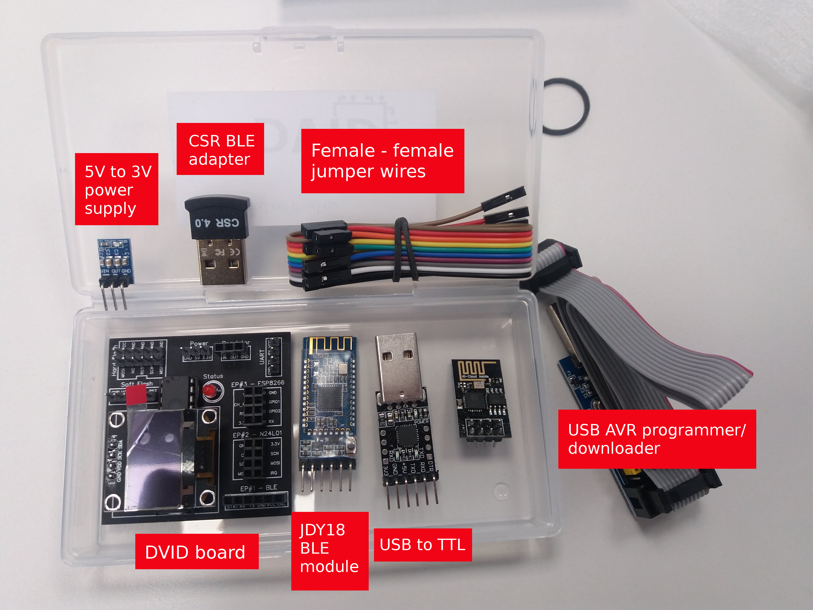

# DVID
Damn Vulnerable IoT Device - The first opensource vulnerable designed IoT device

**/!\\ This project is currently in development /!\\**

All details are available on DVID website : [http://dvid.eu](http://dvid.eu)

# Project overview

This IoT device is designed by my own and published on OpenSource. The main objective is to provide to each interrested people a vulnerable board to improve their skill in IoT hacking.

The board core is composed by a Atmega328p and a OLED screen. For each vulnerabilities, a firmware could be flashed on the Atmega328p in order to offer a specific vulnerable environment.

There is also connection port like UART, Bluetooth, 2,4Ghz and Wifi. In each vulnerability, a specific extension board must be plugged to the board.

Hacking required attacks tools like USBasp and USBuart.

# Board

You can buy the board on marketplace (available soon) or build it yourself with Gerber files.
The board is shipped with theses three packages :
* **Board only and component reference** : Naked board only. You must buy all component yourself and solder all component.
* **Soldered board without attack component and extention** : Soldered board but you must buy all external tools like USBuart, USBasp, extention board.
* **Full package** : Everything needed (soldered board, external board and attack tools).

# Contribution
If you want to contribute to the project, don't hesitate to open a pull request.
By the way, about firmware compilation, you need to compile for atmega328p breadboard 8mhz.
In order to do that, just add this board to the /arduino/hardware/arduino/avr/board.txt file
```bash
##############################################################

atmega328bb.name=ATmega328 on a breadboard (8 MHz internal clock)

atmega328bb.upload.protocol=arduino
atmega328bb.upload.maximum_size=30720
atmega328bb.upload.speed=57600

atmega328bb.bootloader.low_fuses=0xE2
atmega328bb.bootloader.high_fuses=0xDA
atmega328bb.bootloader.extended_fuses=0x05

atmega328bb.bootloader.file=atmega/ATmegaBOOT_168_atmega328_pro_8MHz.hex
atmega328bb.bootloader.unlock_bits=0x3F
atmega328bb.bootloader.lock_bits=0x0F

atmega328bb.build.mcu=atmega328p
atmega328bb.build.f_cpu=8000000L
atmega328bb.build.core=arduino:arduino
atmega328bb.build.variant=arduino:standard


atmega328bb.bootloader.tool=arduino:avrdude
atmega328bb.upload.tool=arduino:avrdude
```

# Write-up
Many thanks to @ghozt, @shoxxdj and @podalirius

## Hardware
* Find The Datasheet - EN - http://blog.ghozt.ninja/2019/07/19/findthedatasheet/
* Find The Datasheet - FR - https://shoxxdj.fr/dvid-hardware-find-the-datasheet/
* Find The Datasheet - EN - https://podalirius.net/writeups/dvid-writeup-01-hardware-find-the-datasheet/

## Firmware
* Hardcoded Password - EN - https://podalirius.net/writeups/dvid-writeup-02-firmware-hardcoded-password/
* Default Password - FR - https://shoxxdj.fr/dvid-firmware-defaultpassword/
* Default Password - EN - https://podalirius.net/writeups/dvid-writeup-03-firmware-default-password/

## Bluetooth
* Advertising - EN - https://podalirius.net/writeups/dvid-writeup-04-bluetooth-advertise/
* Characteristics - EN - https://podalirius.net/writeups/dvid-writeup-05-bluetooth-characteristics/
* Characteristics2 - EN - https://podalirius.net/writeups/dvid-writeup-06-bluetooth-characteristics2/


# Part list

Part | Quantity | Total Cost | Buying link
--- | --- | --- | ---
Board | 1 | 3€ | Available soon or build yourself :)
Jumper Double Row Female 2x4P | 2 | 1€ | https://www.banggood.com/30pcs-2_54mm-2x4P-8P-Double-Row-Female-Straight-Pin-Header-Needle-Socket-Pin-Strip-p-1348262.html
Jumper Single Row Male | 4 | 1€ | https://www.banggood.com/10Pcs-40-Pin-2_54mm-Male-Female-SIL-Socket-Row-Strip-PCB-Connector-p-953436.html
28 pins socket (for atmega328p) | 1 | 0,5€ | https://www.banggood.com/50pcs-28-Pins-IC-DIP-2_54mm-Wide-Integrated-Circuit-Sockets-Adaptor-p-1211042.html
Oled Screen 4Pin white | 1 | 5€ | https://www.banggood.com/1_3-Inch-4Pin-White-OLED-LCD-Display-12864-IIC-I2C-Interface-Module-For-Arduino-p-1067874.html
Atmega328p | 1 | 3€ | https://www.banggood.com/DIP28-ATmega328PPU-MCU-IC-Chip-With-Arduino-UNO-Bootloader-p-932159.html
5V to 3V power supply | 1 | 1€ | https://www.banggood.com/5V-To-3_3V-DC-DC-Step-Down-Power-Supply-Buck-Module-AMS1117-800MA-p-933674.html
Status led | 1 | 0,5€ | https://www.banggood.com/10pcs-5mm-3000-6000mcd-LED-Bright-Decoration-Torch-Toy-Light-Green-p-73175.html
Total |  | 15€ |

# Attack tools and extention board

Part | Quantity | Total Cost | Buying link
--- | --- | --- | ---
UsbUART | 1 | 3€ |  https://www.banggood.com/CP2102-USB-To-TTL-Module-p-1263924.html
UsbASP adapter | 1 | 4€ | https://www.banggood.com/3_3V-5V-USBASP-USBISP-AVR-Programmer-Downloader-ATMEGA8-ATMEGA128-With-Download-Cable-p-1179967.html
AT-09 BLE module | 1 | 2€ | https://www.banggood.com/AT-09-4_0-BLE-Wireless-bluetooth-Module-Serial-Port-CC2541-Compatible-HM-10-Module-Connecting-Single-Chip-Microcomputer-p-1455191.html
CSR BLE adapter | 1 | 4€ | https://www.banggood.com/Mini-Wireless-Dongle-CSR-4_0-Bluetooth-Adapter-V4_0-USB-2_03_0-For-Win-7810XP-For-Vista-3264-p-1132661.html
Jumper Wire female female | 1 | 2€ | https://www.banggood.com/120pcs-20cm-Male-To-Female-Female-To-Female-Male-To-Male-Color-Breadboard-Jumper-Cable-Dupont-Wire-Combination-For-Arduino-p-974006.html
ESP8266 | 1 | 2€ | https://www.banggood.com/Upgraded-Version-1M-Flash-ESP8266-ESP-01-WIFI-Transceiver-Wireless-Module-p-979509.html
Total |  | 17€ |





# Troubleshooting
In case of frying your board, you may encounter some issue with new version of chinese component. This part is dedicated to allow you to start to discuss with your component and put it in the ready-to-hack configuration

## Bluetooth AT-09
Last received parcel contains a new version of the AT-09, named MLT-BT05. This new version natively discuss over UART with 115200 baudrate.
The DVID can discuss to peripherial with 9600 baudrate.
In order to change that, follow those steps:
* Connect your AT-09 to your uart dongle : RX>TX, TX>RX, VCC>VCC and Gnd>Gnd
* Open a serial monitor and type : AT+BAUD4
* If you receive "OK", your BLE peripherial is ready-to-hack

## Atmega328p
Last received parcel contains a new version of Atmega328p. This version seems to be virgin and allow communication with very slow SCK.
In order to modify the internal configuration (fuse), follow those steps:
* Solder (or shortcut) the Jumper #3 on the USBasp flashing dongle
* Type this command to be sure that you can communicates with the broken Atmega328p : avrdude -v -patmega328p -cusbasp
* If you receive "hfuse reads D9" and "lfuse reads FF", your device is already ready-to-hack
* If not, type this command : avrdude -v -patmega328p -U lfuse:w:0xE2:m -cusbasp
* You can type again avrdude -v -patmega328p -cusbasp to be sure that fuse configuration changed

You can not unsolder or remove shortcut on the Jumper #3. If you don't remove it, flashing process will take 20 more times.
You can now flash all firmware on you DVID !

